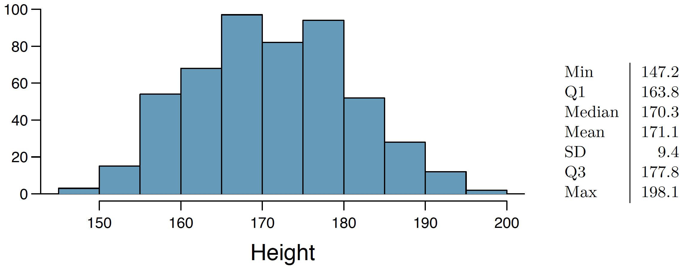
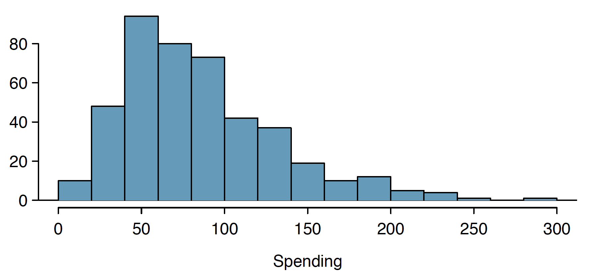
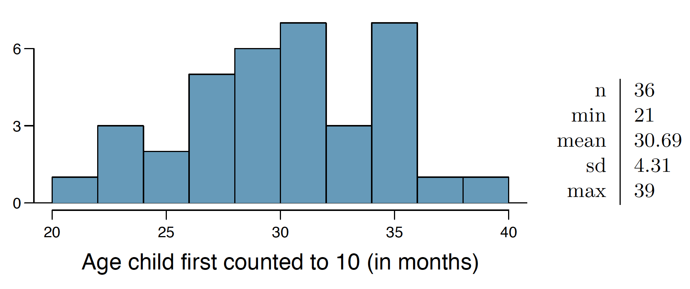
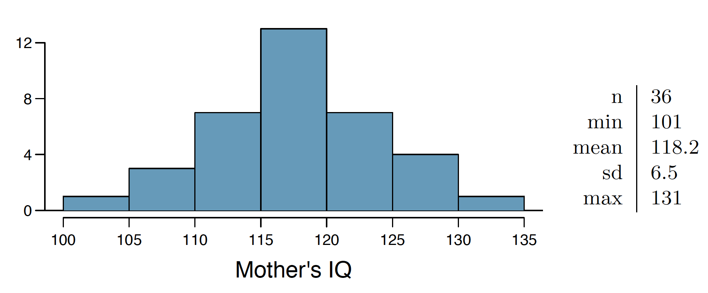

```{r setup, include=FALSE}
knitr::opts_chunk$set(echo = TRUE)
```

#Chapter 4 - Foundations for Inference

###4.4 Heights of adults. 
Researchers studying anthropometry collected body girth measurements and skeletal diameter measurements, as well as age, weight, height and gender, for 507 physically active individuals. The histogram below shows the sample distribution of heights in centimeters



(a) What is the point estimate for the average height of active individuals? What about the
median? (See the next page for parts (b)-(e).)

average height of active individuals = 171.1
median = 170.3

(b) What is the point estimate for the standard deviation of the heights of active individuals?
What about the IQR?

standard deviation of the heights of active individuals = 9.4
IQR = 177.8 - 163.8 = 14

(c) Is a person who is 1m 80cm (180 cm) tall considered unusually tall? And is a person who is
1m 55cm (155cm) considered unusually short? Explain your reasoning.

For someone to be considered unusually tall (or short) his or hers height would be more than 2 standard deviations from the mean:

```{r}
hsamp_mean<-171.1
hsamp_sd<-9.4
hupper<-hsamp_mean+2*hsamp_sd
hlower<-hsamp_mean-2*hsamp_sd
c(hlower,hupper)

test_tall<-function(h) {
  print(h)
  if (h>hsamp_mean) {
    if(h>hupper) {
      print("is unussually tall")
    } else {
      print("is not unussually tall")
    }
  } else {
    if(h<hlower) {
        print("is unussually short")
      } else {
        print("is not unussually short")
      }
  }
}

test_tall(180)

test_tall(155)
```

(d) The researchers take another random sample of physically active individuals. Would you
expect the mean and the standard deviation of this new sample to be the ones given above?
Explain your reasoning.

No we would not expect the new sample to have the same point statistics. Each time a new sample is taken, different picks are taken from the populations, so our sample will have different elements and therefore different point estimates. The distributions of the populations will have an effect on how different are point estimates from different samples.

(e) The sample means obtained are point estimates for the mean height of all active individuals, if the sample of individuals is equivalent to a simple random sample. What measure do we use to quantify the variability of such an estimate? Compute this quantity using the data from the original sample under the condition that the data are a simple random sample.

To quantify this variability we use the sample error or standard deviation of our sample of means. This is computed by deviding the population standard deviation by the quare root of the number of samples. Becouse we ususally don't have the population standard deviation (we propably wouldn't need point estimates if we did), we use our best estimate, the standard deviation of the sample. We compute this as follows:

```{r}
n<-507
SD<-hsamp_sd/sqrt(n)
SD
```

###4.14 Thanksgiving spending, Part I.
The 2009 holiday retail season, which kicked off on November 27, 2009 (the day after Thanksgiving), had been marked by somewhat lower self-reported consumer spending than was seen during the comparable period in 2008. To get an estimate of consumer spending, 436 randomly sampled American adults were surveyed. Daily consumer spending for the six-day period after Thanksgiving, spanning the Black Friday weekend and Cyber Monday, averaged $84.71. A 95% confidence interval based on this sample is ($80.31, $89.11). Determine whether the following statements are true or false, and explain your reasoning.



(a) We are 95% confident that the average spending of these 436 American adults is between $80.31 and $89.11.

False. We are actually 100% confident that average spending for these 436 Americans is between $80.31 and $89.11, that's because the mean of the sample is always in the confidence interval for that sample.  

(b) This confidence interval is not valid since the distribution of spending in the sample is right
skewed.

False. The distribution of the sample is in fact somewhat skewed, and we would probably want to look at increasing the n to obtain a more normal distribution. But in this case we can probably still use this distribution as normal with a n larger than 30, our n is already 436.

(c) 95% of random samples have a sample mean between $80.31 and $89.11.

False. we are 95% condident the population mean is in this interval, but this says nothing about the mean of other samples 

(d) We are 95% confident that the average spending of all American adults is between $80.31 and
$89.11.

True. We are 95% confident the population mean is between $80.31 and $89.11

(e) A 90% confidence interval would be narrower than the 95% confidence interval since we don’t
need to be as sure about our estimate.

True. At 90% our condidence interval is smaller, so we are less confident the population mean is in this smaller interval than at 95% confidence level.

(f) In order to decrease the margin of error of a 95% confidence interval to a third of what it is
now, we would need to use a sample 3 times larger.

False. Marging of error is calculated as sample standard deviation divided by the square root of the number of samples. So to reduce the marging of error by 3, we need to increase the number of samples by 3^2=9

SE = Sample SD / SQRT(n) => SE/3 = Sample SD / (3SQRT(n)) = Sample SD / SQRT(9n)

(g) The margin of error is 4.4.

True.

```{r}
z<-1.96 #95% confidence interval
n<-436
mu<-84.71
upper<-89.11
lower<-80.31
SE<-(mu-lower)/z
SE
SE<-(upper-mu)/z
SE
ME<-z*SE
ME
```

###4.24 Gifted children, Part I.
Researchers investigating characteristics of gifted children collected data from schools in a large city on a random sample of thirty-six children who were identified as gifted children soon after they reached the age of four. The following histogram shows the distribution of the ages (in months) at which these children first counted to 10 successfully. Also provided are some sample statistics.



(a) Are conditions for inference satisfied?

Conditions seem to be met. The sample has an n larger than 30, it was taken from a large population, collected from a large city so they are likely independent, and the distribution doesn't seem to me strongly skewed, it does have a normal shape.

(b) Suppose you read online that children first count to 10 successfully when they are 32 months
old, on average. Perform a hypothesis test to evaluate if these data provide convincing evidence
that the average age at which gifted children fist count to 10 successfully is less than the general
average of 32 months. Use a significance level of 0.10.

We define a null and alternate hypothesis:

Ho: average for gifted children to count to 10 is 32 months     
Ha: average for gifted children to count to 10 is lower than 32 months

We test the alternate to see if there is enough evidence that 32 months does not fall in the confidence interval for the gifted sample. That is that it is not likely that gifted children count to 10 in as late as 32 months

```{r}
samp_mean<-30.69
samp_sd<-4.31
n<-36
mu<-32

#we calculate the standard error for the gifted children sample
SE<-samp_sd/sqrt(n)
SE
#we calculate the Z score for the average of all kids
z<-(mu-samp_mean)/SE
z
#we calculate the p-value, since we are testing to see if gifted kids read as late as 32 month, or that gifted children read in less than 32 months we look at a significance level of 10 on the upper tail
pval<-pnorm(z,lower.tail = FALSE)
pval
if (pval<0.1) {
  print('we reject the null, there is evidence that gifted children count in average before 32 month')
} else {
  print('we can not reject the null, there is not enough evidence that gifted children count in average before 32 month')
}
```

(c) Interpret the p-value in context of the hypothesis test and the data.

The p-value represent the probability that a gifted child can read in 32 or more months. In our case we calculated this to be 0.034. This value is lower than the given significant of 0.10. A p-value greater than 0.10 would mean that there is more than a 0.10 probability that a gifted child can can count to 10 in 32 months.
A single upper tail was used because our null states that gifted children count in less than 32 months. A two tail would mean that non gifted children could in fact count in shorter time than gifted, the lower tail. In this case our alternate would be that average for gifted children to count to 10 is different from 32 month, not that it is lower. 

(d) Calculate a 90% confidence interval for the average age at which gifted children first count to
10 successfully.

Since we are looking for for when children first count to 10, we are looking at a one tail. Our confidence interval starts at minus infinite, and ends at 90%. This means that we are 90% confident gifted children count to 10 in less than the number of months calculated below.

```{r}
samp_mean<-30.69
samp_sd<-4.31
n<-36
SE<-samp_sd/sqrt(n)
cri_val<-qnorm(0.9) #we calculate the critical value for a 90% confidence interval
cri_val
upper<-samp_mean+cri_val*SE 
upper
```


(e) Do your results from the hypothesis test and the confidence interval agree? Explain.

Yes they do, 32 months is outside the confidence interval.
We can also see the agreement in the z value and critical value. For 10% confidence level the critical value is as calculated in r 1.28. The z value obtained for 32 months is 1.82, which is higher than the critical value, or further away from the mean, reason why we rejected the null.

###4.26 Gifted children, Part II.
Exercise 4.24 describes a study on gifted children. In this study,
along with variables on the children, the researchers also collected data on the mother’s and father’s
IQ of the 36 randomly sampled gifted children. The histogram below shows the distribution of
mother’s IQ. Also provided are some sample statistics.



(a) Perform a hypothesis test to evaluate if these data provide convincing evidence that the average IQ of mothers of gifted children is different than the average IQ for the population at large, which is 100. Use a significance level of 0.10.

Ho: IQ mothers of gifted children = 100 (population at large IQ)    
Ha: IQ mothers of gifted children $\neq$ 100 (population at large IQ) 

```{r}
samp_mean<-118.2
samp_sd<-6.5
n<-36
mu<-100

SE<-samp_sd/sqrt(n)
z<-(mu-samp_mean)/SE
pval<-2*pnorm(z)
#since our hypothesis is that IQ is different, either higher or lower, we use a two tail test, so we are looking at pval being lower than 0.05 or 0.1/2
if (pval<0.05) {
  print("We reject the null, we are confident the IQ of gifted children is not the same as the population at large, or 100")
} else {
  print("We do not have enough confidence to reject the null, it is possible that gifted children mothers have the same IQ as the population at large of 100")
}
pval
```

(b) Calculate a 90% confidence interval for the average IQ of mothers of gifted children.

```{r}
cri_val<-qnorm(0.95) #two tailed 0.1 confidence interval, from -0.95 to 0.95 
cri_val
upper<-samp_mean+cri_val*SE 
lower<-samp_mean-cri_val*SE
c(lower,upper)
```

(c) Do your results from the hypothesis test and the confidence interval agree? Explain.

Yes, they do agree. Our confidence interval does not include 100, the population at large IQ. Which agrees with the pval being much smaller than the required 0.05 for a 0.1 two tail significance level.

###4.34 CLT.
Define the term “sampling distribution” of the mean, and describe how the shape, center, and spread of the sampling distribution of the mean change as sample size increases.

The sampling distribution of the mean is the probability distribution of all possible samples of size n drawn from a population. This distribution is a normal distribution centered, that is with a mean equal to the mean of the population, as long as the population distribution is nor stringly skewed. Its standard deviation, called standard error, is dependent on the number of samples n. As n increases, the standard error decreases. The different samples n need to be independent. For this to stay true a rule of thumb is to keep n below the 10% of the population N.

###4.40 CFLBs.
A manufacturer of compact fluorescent light bulbs advertises that the distribution of the lifespans of these light bulbs is nearly normal with a mean of 9,000 hours and a standard deviation of 1,000 hours.

(a) What is the probability that a randomly chosen light bulb lasts more than 10,500 hours?

We use the pnorm function with the lower.tail variable set to FALSE so that it calculates the probability of the bulb lasting 10,500 hours  or longer

```{r}
pop_mean<-9000
pop_sd<-1000
pnorm(10500,pop_mean,pop_sd,lower.tail = FALSE)
```

(b) Describe the distribution of the mean lifespan of 15 light bulbs.

This should be a normal distribution with a mean similar to the population mean of 10,500. The standard deviation is given by the standard error formula as calculated below. In r we can simulate a sample of 15 light bulbs using the rnorm function

```{r}
samp_mean<-pop_mean
n<-15
SE<-pop_sd/sqrt(15)
SE
dist_fifteen<-rnorm(n,samp_mean,SE)
hist(dist_fifteen,freq = FALSE,ylim=c(0,0.0025))
x <- seq(8000,10000, by = 0.01)
y <- dnorm(x,samp_mean,SE)
lines(x = x, y = y, col = "blue")
qqnorm(dist_fifteen)
qqline(dist_fifteen)
```

(c) What is the probability that the mean lifespan of 15 randomly chosen light bulbs is more than 10,500 hours?

This probability is very low, almost zero as seen below.

```{r}
pnorm(10500,samp_mean,SE,lower.tail = FALSE)
```

We know the propability of chosing one with a lifespan of 10,500 hours or more in 0.5, since 10,500 is the mean of the population. 

(d) Sketch the two distributions (population and sampling) on the same scale.

```{r}
par(mfrow = c(2,1))
dist_fifteen<-rnorm(n,samp_mean,SE) #already calculated, but showen again
dist_population<-rnorm(10000,pop_mean,pop_sd)
hist(dist_population, xlim = c(4000,14000), prob = TRUE)
lines(density(dist_population, adjust = 2), col = "red")
hist(dist_fifteen, xlim = c(4000,14000), prob = TRUE)
lines(density(dist_fifteen, adjust = 2), col = "blue")
```


(e) Could you estimate the probabilities from parts (a) and (c) if the lifespans of light bulbs had a skewed distribution?

No, if the lifespand of the light bulds had a skwed distribution we would need more than 15 samples in our sample mean, we would want at least 30 so that the sample mean distribution would be normal, as per the central limit theorem.

###4.48 Same observation, different sample size.
Suppose you conduct a hypothesis test based on a sample where the sample size is n = 50, and arrive at a p-value of 0.08. You then refer back to your notes and discover that you made a careless mistake, the sample size should have been n = 500. Will your p-value increase, decrease, or stay the same? Explain.

The p-value will decrease. This is becouse when we increase the number of samples n, the standard error decreases since it is inversely proportional the the square root of n. SE=sd/sqrt(n)
The effect of increasing n is to make the distribution of sample means narrower, that is with a lower standard deviation or standard error. If the distribution is narrower, when we calculate the p-value this will be smaller, since with narrower distributions we have less tail. The effect on the hypothesis test that we may rejct the null for the same confident level my increasing the value of n.


